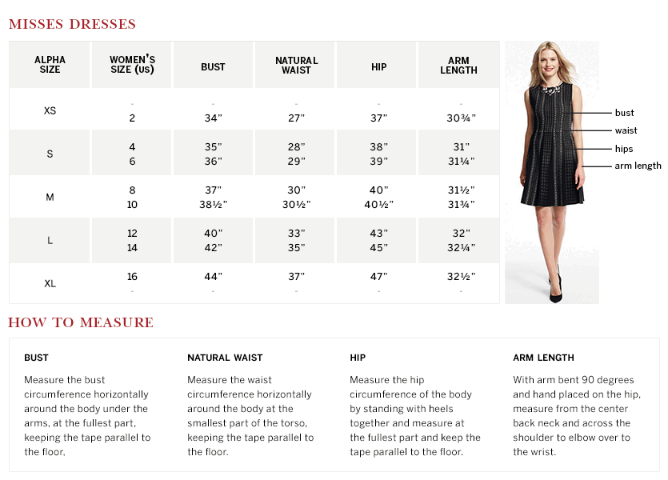
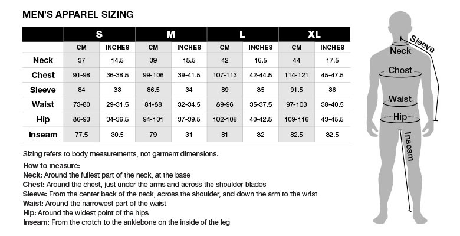

# Secret Sauce Size Calculator

Calculate your size with ease!

## Background

Sizing is quite inconsistent and there can be great differences in fit and
measurement among brands. Size charts can help navigate the landscape when
shopping online.

Reading size charts is not always straightforward. The Secret Sauce Size
Calculator was born to address this. The calculator works based on size charts.

Size charts contain the measurements for each size label used by brands or
designers for garments sold. There are a large number of standard sizing systems
around the world.

## Concepts

### Size Charts

Size charts (also called size guides) are provided by manufacturers for their
brands and can apply to one or more apparel categories. Separate size charts
exist for women and men.

Size charts usually have the following properties:

* Brand or designer
* Product category such as dresses, pants, sneakers
* Size labels and physical measurements for those labels
* Measurement types: an apparel item has multiple dimensions. For example
  a dress can have bust, hip, and waist, a jeans can have waist and inseam
  measurements.
* Size system: different countries use different size labels for the same
  physical measurements
* Sizing: alpha (S, M, L) or numeric (2, 4, 6)

## Size chart examples

### Dressbarn Misses Dresses Size Chart



[Source](https://www.dressbarn.com/customer-service/size-charts)

### Black Diamond Men's Apparel Size Chart



[Source](http://blackdiamondequipment.com/en/size-chart-apparel-mens-f13.html)

## Size calculator examples

* [Lidl Size Calculator](https://www.lidl.co.uk/en/Sizecalculator.htm?country=uk&lang=en)
* [Cacltool](http://www.calctool.org/CALC/other/home/dress_size)
* [Shopfans Caclulator](https://shopfans.com/clothes/size.html)

## Running the API

An example UI implementation can be found in the `frontend/` directory. A mock API
implementation with hard-coded responses can be found in the `api/` directory.

The example API uses Node.js.

Running the API:

    # Install nodejs if necessary
    # Build UI
    $ cd frontend && npm install && webpack && cd ..

    # Start the API
    $ cd api
    $ npm install
    $ npm start

Visit http://localhost:3000.

## API specification

A simple REST API that exposes the necessary resources.

### List brands

Lists the brands that the calculator can calculate the size for.

```
GET /brands
Response: 200 (application/json)

{
    "brands": [
        {
            "key": "calvin-klein",
            "name": "Calvin Klein"
        },
        {
            "key": "florence-eiseman",
            "name": "Florence Eiseman"
        }
    ]
}
```

### List categories

Lists the categories that the calculator can calculate size for a brand.
```
GET /categories?brand=calvin-klein
Response: 200 (application/json)

{
    "categories": [
        {
            "key": "dresses",
            "name": "Dresses",
            "measurement_type": "bust"
        },
        {
            "key": "jeans",
            "name": "Jeans",
            "measurement_type": "waist"
        }
    ]
}
```

### Get a prediction

Based on a brand, category and measurement it provides one or more size
labels that best fit.

```
GET /prediction?brand=calvin-klein&category=dresses&measurement=32
Response: 200 (application/json)

{
    "prediction": {
        labels: ["S", "4"]
    }
}
```

If there is no meaningful size label for the input, the API returns an error
with an informative message.

```
Response: 404 (application/json)

{
    "error": {
        "message": "Too large"
    }
}
```

## License

All code, including contributions in GitHub forks and pull requests fall under
the permissive [MIT license](LICENSE).

## References

* https://en.wikipedia.org/wiki/Clothing_sizes
* https://en.wikipedia.org/wiki/US_standard_clothing_size
* https://en.wikipedia.org/wiki/EN_13402
